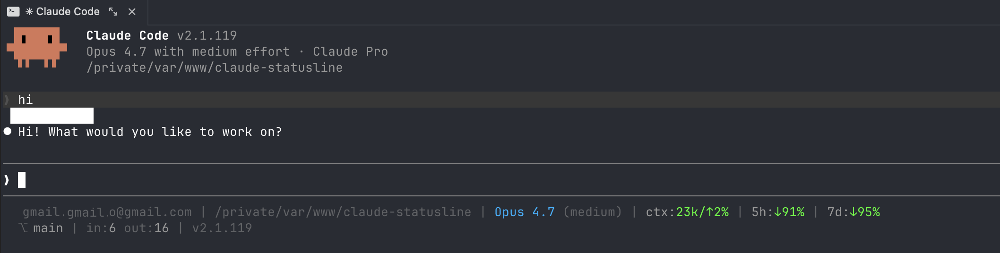
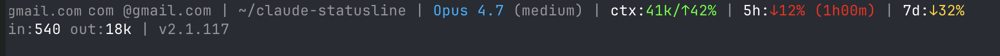

# Claude Code Status Line

A compact, informative two-line status line for [Claude Code](https://docs.claude.com/claude-code). Shows account, project, model, context usage, rate-limit headroom, git branch, session tokens, and version.

## Preview



```
my-mail@maybe-gmail.com | ~/my-project | Sonnet 4.6 (medium) | ctx:44k/↑5% | 5h:↓72% | 7d:↓92%
⎇ main | in:540 out:18k | v2.1.117
```

When you get close to a limit, the segment turns red and shows the reset ETA:



```
… | 5h:↓9% (3h12m) | 7d:↓12% (2d4h)
```

## Features

**Line 1 - identity & limits**

- Logged-in Claude account email (pulled from `~/.claude.json`)
- Current project path (with `~` substitution for `$HOME`)
- Model name + current effort level (`low`/`medium`/`high`)
- Context window: absolute tokens + percent **used** (`↑` = growing toward cap)
- 5-hour rate limit **remaining** (`↓` = depleting; reset ETA shown when red)
- 7-day rate limit **remaining** (`↓`; reset ETA shown when red)

**Line 2 - session & repo**

- Git branch (when project dir is a git repo)
- Session cumulative input / output tokens
- Extra-usage credit balance (only when credits are granted on the account)
- Installed Claude Code version

## Color thresholds

All three usage segments share the same health thresholds based on **used %**. The color always reflects health relative to the cap - independent of whether the number shown is "used" or "remaining".

| Segment | Shown as        | 🟢 Green                  | 🟡 Yellow                 | 🔴 Red                    |
| ------- | --------------- | ------------------------- | ------------------------- | ------------------------- |
| **ctx** | used (`↑`)      | 0–59% used                | 60–84% used               | 85–100% used              |
| **5h**  | remaining (`↓`) | 41–100% left (0–59% used) | 16–40% left (60–84% used) | 0–15% left (85–100% used) |
| **7d**  | remaining (`↓`) | 41–100% left (0–59% used) | 16–40% left (60–84% used) | 0–15% left (85–100% used) |

Colors are emitted with 256-color ANSI codes (46 green, 220 amber, 196 red) to avoid terminal-theme remapping - many themes render plain ANSI green as olive/yellow.

## Requirements

- `bash` (any version with associative-array-free features - works on macOS system bash 3.x)
- `jq` - `brew install jq` (macOS) or `apt install jq` (Debian/Ubuntu)
- `awk`, `sed`, `date`, `git` - all standard

## Installation

See [INSTALL.md](./INSTALL.md) for step-by-step instructions (manual, one-liner, or via Claude Code itself).

## Customization

Edit `statusline-command.sh`:

- **Thresholds** - change the two `-ge` comparisons in `pct_color()` (lines with `85` and `60`).
- **Colors** - the block starting `reset=$'\033[0m'` defines each color; swap for your preferred 256-color codes (`\033[38;5;Nm`).
- **Email fallback** - if `~/.claude.json` doesn't exist, the script falls back to `$USER`. Change that line if you want a different default.
- **Path format** - to show only the last folder name, replace the `project=` assignment with `project=$(basename "$project_raw")`.

## How it works

Claude Code runs the configured `statusLine` command on each redraw and pipes a JSON payload to stdin. The script extracts fields via `jq`, formats them, and emits two lines of ANSI-colored text. Data freshness:

- **Model, cwd, version** - live for the session
- **Context, rate limits, session tokens** - snapshot from the last API response (not continuously polled)
- **Email, effort, branch, credits** - read from local config files on every render

## License

MIT - use it, modify it, share it.
